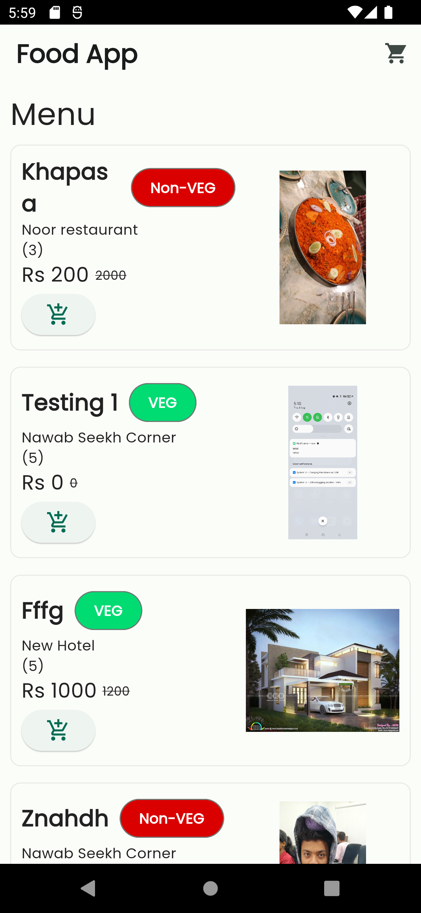
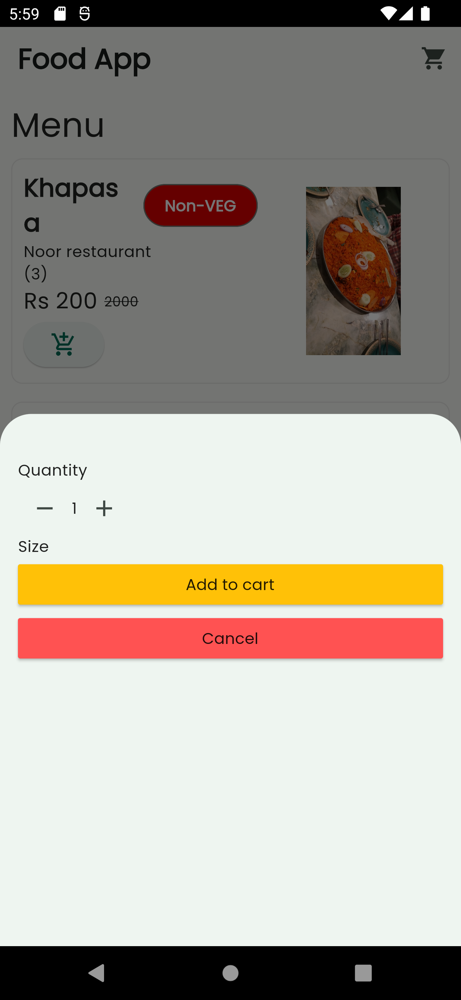
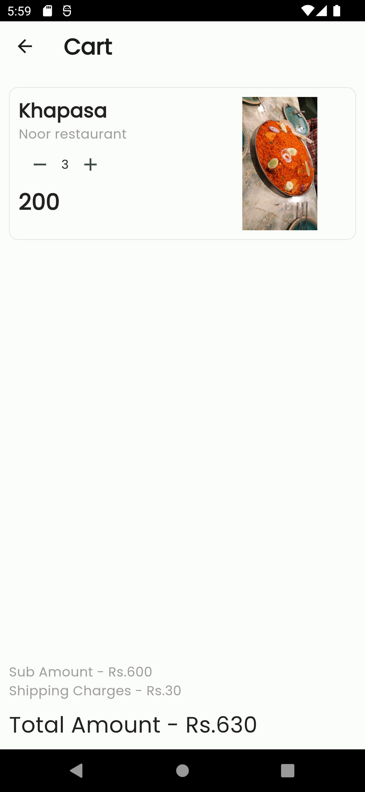

# Notion Task

This is the task given by notion technology to integrate the given api to flutter app

## API integrated

<ol>
<li>Menu List</li>
<li>Cart List</li>
<li>Add item to cart</li>
<li>Get the total amount</li>
<li>Update the qty</li>
</ol>

## Setup

Clone the repo

```bash
    git clone https://github.com/sammulla10/Notion
```

Install the packages

```bash
    flutter pub get
```

Run the code

```bash
    flutter run
```

## Output

<div>
   <h3>Menu page</h3>

</div>
<div>
<h3>Purchase detail section </h3>
    
</div>
<div>
<h3>Cart page </h3>
    
</div>
